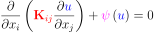
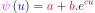
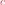
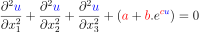
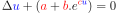
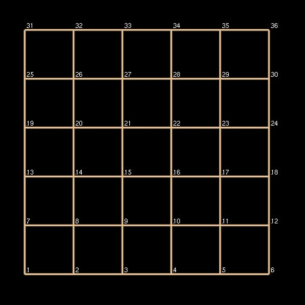
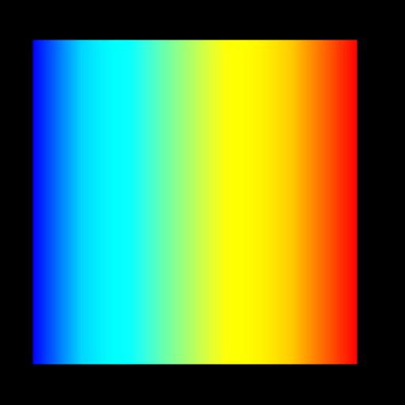
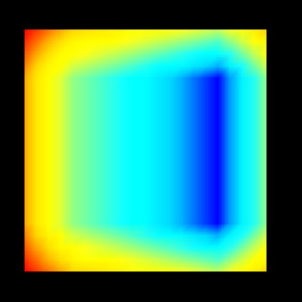

===========================
Non-linear Poisson Equation
===========================

This example solves the weak form of the following Poisson equation,

|generalised_poisson_equation| 

using the Galerkin Finite Element method. |conductivity_tensor| is the positive definite and symmetric rank two conductivity tensor and |psi| is a function (non-linear in this example) of the dependent variable |u|. The latter is a spatially varying scalar field (e.g. temperature). 

The non-linear function or source term is an exponential function of |u| that takes the following form.

|nonlinear_function|.

Note that the conductivity tensor and parameters in the source term (|a|, |b| and |c|) are, in general, functions of the independent variable (spatial coordinates) |x|. Since material in this example is considered to be homogeneous, they remain constant throughout the domain. Furthermore, |conductivity_tensor| is set to be |I| (identity tensor). With these simplifications the above  governing equation reduces to

|reduced_nonlinear_poisson_equation1| or 

|reduced_nonlinear_poisson_equation2|.

Only Dirichlet boundary conditions are prescribed in this example.

   
.. |psi| image:: ./docs/images/psi.svg
   :align: middle   
   
.. |u| image:: ./docs/images/u.svg
   :align: middle
   

   
.. |a| image:: ./docs/images/a.svg 
   :align: middle
   
.. |b| image:: ./docs/images/b.svg   
   :align: middle
   

   :align: middle     
   
.. |x| image:: ./docs/images/x.svg
   :align: middle   
   

   

   

  
.. |du_dn| image:: ./docs/images/du_dn.svg
   :align: middle
   
    
Building the example
====================

The fortran version of the example can be configured and built with CMake::

  git clone https://github.com/OpenCMISS-Examples/nonlinear_poisson_equation
  mkdir nonlinear_poisson_equation-build
  cd nonlinear_poisson_equation-build
  cmake -DOpenCMISSLibs_DIR=/path/to/opencmisslib/install ../nonlinear_poisson_equation
  make

This will create the example executable "nonlinear_poisson_equation" in ./src/fortran/ directory.

Running the example
===================

Fortran version::

  cd ./src/fortran/
  ./nonlinear_poisson_equation

Python version::

  cd ./nonlinear_poisson_equation/src/python
  source  /path/to/opencmisslibs/install/.../.../virtualenvironments/oclibs_pyXY_release/bin/activate
  python nonlinear_poisson_equation.py
  
  Note: If the above fails, try the following.
  cd ./nonlinear_poisson_equation/src/python
  PYTHONPATH="/path/to/opencmisslibs/install/.../.../Release/opencmiss.iron" python nonlinear_poisson_equation.py  

Verifying the example
=====================

Results can be visualised by running `visualise.cmgui <./src/fortran/visualise.cmgui>`_ with the `Cmgui visualiser <http://physiomeproject.org/software/opencmiss/cmgui/download>`_.

The following figure shows the finite element mesh (computational domain) and scalar field, |u| (primary variable) and its derivative, |du_dn| (secondary variable).  
 

   

   :width: 250
   :scale: 100
   

   :width: 250
   :scale: 100   
    
|figure1a|  |figure1b|  |figure1c|

Figure 1. (a) Finite element mesh (b) Primary variable solution (c) Secondary variable solution
    
The expected results from this example are available in `expected_results <./src/fortran/expected_results>`_ folder.    
    
Prerequisites
=============

There are no additional input files required for this example as it is self-contained.

License
=======

License applicable to this example is described in `LICENSE <./LICENSE>`_.
